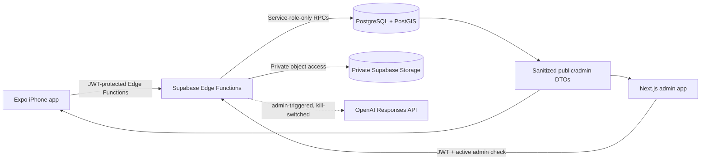

# Pothole Montréal

Pothole Montréal is an independent civic-tech portfolio project for reporting, mapping, and reviewing road damage. The repository demonstrates an iOS-first Expo application, a protected Next.js moderation dashboard, and a Supabase/PostgreSQL backend designed around privacy-conscious uploads, PostGIS queries, explicit authorization boundaries, and human-controlled moderation.

> [!IMPORTANT]
> This is an independent portfolio project. It is not affiliated with, endorsed by, operated by, or an official service of the City of Montréal.

## Project status

This is a development-stage portfolio build, not a production municipal service. Citizen reporting, duplicate suggestions, the public map, administrator moderation, AI Shadow Mode, and read-only shadow triage are implemented. Repair dispatch, crew workflows, production operations, and automatic AI moderation are not implemented.

| Area | Status |
| --- | --- |
| Citizen iPhone reporting flow | Implemented |
| Camera, location, address, and adjustable map pin | Implemented |
| PostGIS map and nearby duplicate suggestions | Implemented |
| Retry-safe report finalization and private photo storage | Implemented |
| Protected administrator moderation | Implemented |
| Administrator-triggered AI visual assessment | Shadow mode only |
| Shadow queue triage and evaluation foundation | Read-only |
| Automatic AI verification or rejection | Not implemented |
| Crew assignment and repair workflow | Roadmap |

## Screenshots

Sanitized screenshots are not currently tracked. Before adding them, remove user identities, session information, private image URLs, real citizen photos, precise live-backend identifiers, and any other private data.

Suggested portfolio captures:

- Citizen photo, location, review, and success flow
- Public pothole map and nearby-match choice
- Administrator moderation queue and detail view
- AI Assessment card and clearly separated shadow-triage hint

## Key features

- English/French citizen experience built with React Native, Expo, TypeScript, and Expo Router
- Camera capture, GPS-assisted positioning, reverse-geocoded address snapshots, and an adjustable map pin
- Private JPEG upload through a narrowly scoped signed-upload workflow
- Anonymous Supabase Auth sessions without broad anonymous table access
- PostgreSQL/PostGIS viewport queries and distance-based duplicate suggestions
- Idempotent report submission with database-generated `MTL-######` identifiers
- Next.js administrator dashboard with server-side active-membership authorization
- Locked moderation transitions and append-only human status history
- Private photo review through short-lived, administrator-only signed URLs
- Administrator-triggered OpenAI visual assessment in Shadow Mode
- Immutable AI assessment history, privacy-safe operational telemetry, and deterministic read-only triage

## Architecture



The mobile and browser clients receive only the public Supabase URL and publishable key. Privileged database operations remain behind JWT-verified Edge Functions and narrowly granted RPCs. Application tables retain RLS/default-deny policies, report photos remain private, and administrator membership is checked server-side.

### Citizen reporting flow

1. Capture one JPEG and confirm its location.
2. Review nearby PostGIS candidates and optionally attach the observation to an existing pothole.
3. Request a server-generated upload intent and one-object signed upload token.
4. Upload the photo directly to private Storage.
5. Finalize the report through an atomic, service-role-only, idempotent RPC.
6. Receive the canonical public identifier and view the report on the map.

A physical pothole and a citizen report are separate records: one pothole can accumulate many observations without losing report history.

### Duplicate detection and geospatial data

PostGIS `geography(Point, 4326)` columns are the canonical searchable locations. Viewport reads use bounded database queries and GiST indexes. Nearby suggestions use `ST_DWithin`, are capped and distance-sorted, and never make an automatic duplicate decision; the citizen chooses whether to report an existing pothole.

### Administrator moderation

The dashboard uses Supabase email/password authentication and `@supabase/ssr`, but a session alone is not authorization. Every protected administrator function validates the JWT and checks active `admin_users` membership server-side. Human operators control the limited moderation transitions, including required rejection reasons, and every successful transition creates an immutable audit event.

### AI Shadow Mode and triage

An active administrator may explicitly request an assessment of up to three deterministic, server-selected private photos. The server sends only selected image bytes and centralized visual instructions to the OpenAI Responses API, uses strict Structured Outputs with `store: false`, validates the result, and stores immutable assessment history.

AI analysis is disabled unless the server-only `AI_ANALYSIS_ENABLED` value is exactly `true`. Future automation is separately disabled by default. Queue triage is derived from existing assessments through an immutable policy and performs no provider call.

**AI never automatically verifies or rejects a pothole, changes status or report counts, creates moderation events, or overrides human decisions.** Human moderation remains authoritative.

## Technology stack

- Mobile: React Native, Expo, Expo Router, TypeScript
- Admin: Next.js App Router, React, TypeScript, Tailwind CSS, `@supabase/ssr`
- Backend: Supabase Auth, Edge Functions, PostgreSQL, PostGIS, private Storage, RLS
- AI: OpenAI Responses API behind a server-only provider boundary
- Testing: Vitest, ESLint, TypeScript, Expo dependency checks, pgTAP, Supabase database lint
- CI: GitHub Actions with isolated local Supabase services

## Repository layout

```text
apps/mobile/                 Expo citizen application
apps/admin/                  Next.js moderation dashboard
supabase/functions/          JWT-protected Edge Functions
supabase/migrations/         Version-controlled schema and security changes
supabase/tests/database/     pgTAP database contracts
tests/unit/                  Shared backend/admin unit tests
.github/workflows/ci.yml     Public-safe quality and local database checks
```

## Local development

### Prerequisites

- Node.js 22.x
- npm 10.x
- Expo Go and a physical iPhone for the mobile flow
- Docker only for the local Supabase database suite

Install dependencies:

```powershell
npm ci

cd apps/mobile
npm ci --legacy-peer-deps
cd ../..

cd apps/admin
npm ci
cd ../..
```

Create local environment files from the committed examples. Use your own Supabase project; do not point a public fork at the maintainer's development backend.

Mobile environment names:

```dotenv
EXPO_PUBLIC_SUPABASE_URL=
EXPO_PUBLIC_SUPABASE_PUBLISHABLE_KEY=
```

Admin environment names:

```dotenv
NEXT_PUBLIC_SUPABASE_URL=
NEXT_PUBLIC_SUPABASE_PUBLISHABLE_KEY=
```

Server-only Edge Function configuration, when deliberately testing AI:

```text
OPENAI_API_KEY
AI_ANALYSIS_ENABLED
AI_AUTOMATION_ENABLED
```

Never place server-side credentials in Expo, Next.js public variables, documentation, tests, or source control.

Run the mobile app:

```powershell
cd apps/mobile
npm start
```

Scan the QR code with Expo Go on the iPhone. Run the admin dashboard separately with `npm run dev` from `apps/admin` after configuring its public variables and an authorized local/development administrator.

## Testing

```powershell
# Root unit and regression suite
npm test

# Mobile
cd apps/mobile
npm run typecheck
npm run lint
npx expo install --check

# Admin
cd ../admin
npm run typecheck
npm run lint
$env:NEXT_PUBLIC_SUPABASE_URL = 'https://example.supabase.co'
$env:NEXT_PUBLIC_SUPABASE_PUBLISHABLE_KEY = 'build-placeholder'
npm run build
```

Database contracts require Docker and use only an isolated local Supabase stack:

```powershell
npx --no-install supabase start
npm run test:db
npm run lint:db
npx --no-install supabase stop --no-backup
```

GitHub Actions runs the unit, mobile, admin, pgTAP, and database-lint gates without linking to a hosted project.

## Security design

- No service-role, database, JWT-signing, or OpenAI credential belongs in a client application.
- Application tables and private AI/telemetry data use RLS/default deny.
- Privileged RPCs use explicit grants and are callable only through reviewed server boundaries.
- Citizen identity is derived from the validated JWT, never a caller-supplied user ID.
- Storage paths stay server-side; public DTOs are allowlisted.
- AI input excludes identities, coordinates, addresses, citizen notes, Storage paths, and Supabase credentials.
- Operational AI switches default off and do not redefine immutable policy criteria.

See [SECURITY.md](SECURITY.md) for responsible reporting guidance.

## Known limitations

- This is not production infrastructure and has no uptime or municipal-service guarantee.
- Anonymous reporting still needs stronger deployment-level quotas, abuse monitoring, and cost controls before a public beta.
- Durable offline draft recovery and orphan-upload cleanup remain future work.
- Admin-detail pagination, comprehensive image decoding/transcoding, and production web security headers remain pending.
- AI accuracy has not been validated for real automated decisions; automatic moderation is intentionally absent.
- Screenshots and a hosted public demo are not included to avoid exposing development data or infrastructure.

## Roadmap

- Production-grade anonymous abuse controls and observability
- Durable citizen drafts and upload cleanup
- Crew assignment, repair evidence, and public completion status
- Privacy-safe AI-versus-human evaluation over a meaningful sample
- Only after measured safety: a separately reviewed proposal for selective automation

## Portfolio note

This repository is intended to demonstrate mobile product engineering, geospatial database design, secure Supabase boundaries, moderation workflows, and cautious AI integration. Run it against infrastructure you control. No public demo or official Montréal service is implied.

## License

No open-source license has been selected. Unless a license is added, normal copyright restrictions apply. If open-source reuse is desired, the MIT License is a simple permissive option to consider.
